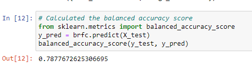

# Credit_Risk_Analysis

## Overview of the analysis
This analysis is solve the credit card risk problem.

## Results
1.RandomOverSampler

* balanced accuracy score: 0.6515938052705158

* Precision
high_risk:0.01
low_risk:1.00
* recall scores
high_risk:0.62
low_risk:0.68

2.SMOTE

* balanced accuracy score: 0.6241876870888075

* Precision
high_risk:0.01
low_risk:1.00
* recall scores
high_risk:0.59
low_risk:0.66

3.ClusterCentroids

* balanced accuracy score: 0.6241876870888075

* Precision
high_risk:0.01
low_risk:1.00
* recall scores
high_risk:0.61
low_risk:0.45

4.SMOTEENN

* balanced accuracy score: 0.5293026900499977

* Precision
high_risk:0.01
low_risk:1.00
* recall scores
high_risk:0.61
low_risk:0.45

5.BalancedRandomForestClassifier

* balanced accuracy score: 0.7877672625306695

* Precision
high_risk:0.04
low_risk:1.00
* recall scores
high_risk:0.67
low_risk:0.91

6.EasyEnsembleClassifier

* balanced accuracy score: 0.925427358175101

* Precision
high_risk:0.07
low_risk:1.00
* recall scores
high_risk:0.91
low_risk:0.94

## Summary
According to the top 6 results, the EasyEnsembleClassifier model has the highest accuracy score
and both precision and recall scores are the highest as well.
So we can say that in this case the EasyEnsembleClassifier model is the best model for credit risk predict.